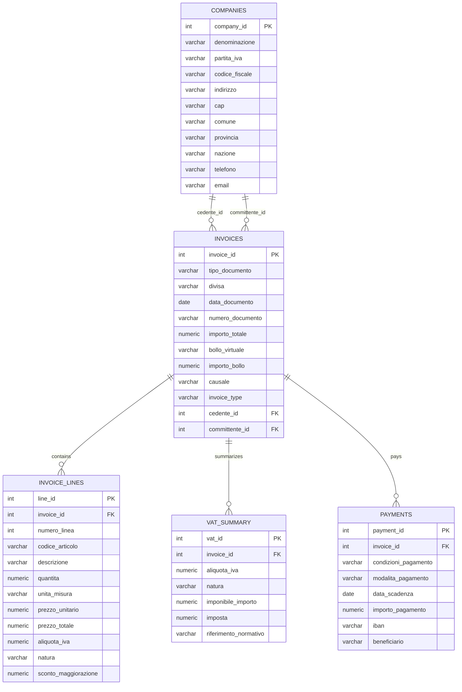

# Entity Relationship Diagram (ERD)

This document describes the relational data model used to store
Italian electronic invoices (FatturaPA).

## Core entities

### companies
Represents both suppliers (cedente/prestatore) and customers (committente).

A company can appear in multiple invoices with different roles.

### invoices
Represents the invoice header.
Each invoice is linked to:
- one supplier (cedente)
- one customer (committente)

The field `invoice_type` distinguishes:
- `attiva` → issued invoices
- `passiva` → received invoices

### invoice_lines
Represents individual invoice line items.
Each invoice can contain multiple lines.

### vat_summary
Represents VAT breakdown per invoice and VAT rate.

### payments
Represents payment terms and payment-related information.

## Relationships

- companies 1 → N invoices (as cedente)
- companies 1 → N invoices (as committente)
- invoices 1 → N invoice_lines
- invoices 1 → N vat_summary
- invoices 1 → 1 payments

The model follows a normalized relational approach to avoid data duplication
and to support analytical queries.

